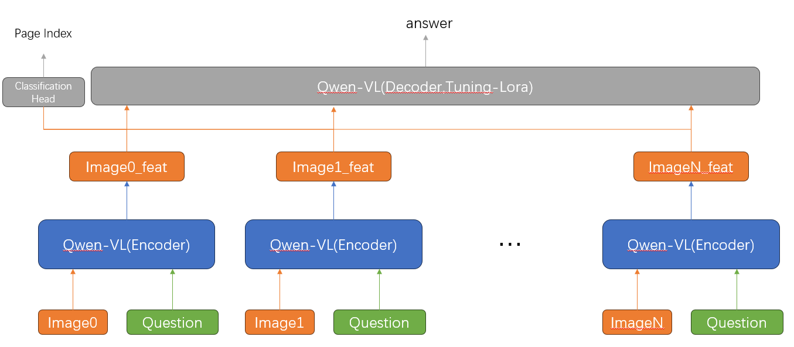
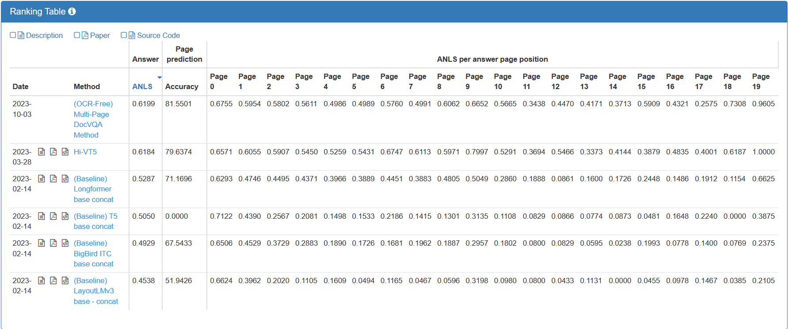
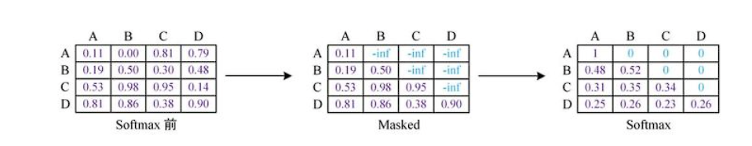

**MPDocVQA Task**

# 数据集介绍

面对的场景是多张图像,一个问题,要求模型从这多张图像中寻找问题的答案以及答案出处是那一页

特点

1. 图像全是文档
2. 问题的正确答案出处页面一定存在 
3. 要回答这个问题,只需要使用一页Doc,不存在需要结合多页才能回答的多跳问题,我理解的是图片虽然多,但是不需要去注意其他图片
4. 一共共有64058张图像
注: 多跳问题的数据集我见过一个[SlideVQA](https://github.com/nttmdlab-nlp/SlideVQA)

一条数据中,主要存在以下内容
1. 问题=>question:str
2. 图像=>page_ids:list,最多20页
3. 回答=>answers: list: 多个正确答案
4. 答案出处=>answer_page_idx: int

例子
```json
{
    "questionId": 24581,
    "question": "Where is the university located ?",
    "doc_id": "nkbl0226",
    "page_ids": [
        "nkbl0226_p0"
    ],
    "answers": [
        "San Diego",
        "san diego"
    ],
    "answer_page_idx": 0,
    "data_split": "val"
}
```

# 模型方案

打算采用Qwen-VL作为baseline，基本的结构
from `Hierarchical multimodal transformers for Multi-Page DocVQA`



目前的想法以及一些问题:
1. 一条数据要发生n次正向传播
2. Qwen-VL得到的特征当作cross-attn模块的输入
3. Decoder部分考虑使用qwen-vl中的llm部分,然后加入cross-attention模块,这个模块需要自己训练
4. 分类头方面,目前先考虑使用MaxPooling,然后接分类头,如果不太行可以考虑升级出一个attention层
5. 选择的问题是什么?
    - 仅使用数据集给出的问题
    - 在预测答案页时,可以改用类似于问题"该问题的答案是否出现这一页?"之类的问题,但是带来的代价是2n次正向传播
6. 采用多任务训练的方式
7. qwen-vl(decoder)当encoder合不合适?
8. 目前还没有任何代码实现（

# 评价指标

评价回答:ANLS(Answer Normalized Levenshtein Similarity)

答案出处评价: Accuracy

目前的LeaderBoard



# First Step

利用qwen-vl提取图像特征,保存到文件中 
1.  save to `./data/feature/`
2. src => `./src/get_feature.py`

提取embedding的方案

1. 将prompt输入,直接获取 last_hidden_states
2. 将prompt输入,然后要求模型预测next token,直到eos或者最大长度,将预测出来的那部分的embeddding作为结果
    调用generate函数,得到的应该是向量

# past_key_values 和 use_cache
这部分内容和kv_cache有关,kv_cache可以加快推理的速度,但是会增加显存的占用

Linear层 H = WX + b

将X拆分为 [(seq-1,hidden_in) | (1, hidden_in)] 
WX = W * [(seq-1,hidden_in) | (1, hidden_in)] = [(seq-1,hidden_out) | (1, hidden_out)]
其中(seq-1,hidden_out)是上一步推理中已经计算过的,因此我们没有必要在计算一次
缓存key size =   (batch_size, head, seq, head_size)
缓存value size = (batch_size, head, seq, head_size)
```
Tuple[tuple,tuple]
0 is key, 这个tuple包含了每一个transformer层的key
1 is value, 这个tuple包含了每一个transformer层的value
key   size = (batch_size, head, seq, head_size)
value size = (batch_size, head, seq, head_size)
```

具体使用则是

[Transformer库中的术语介绍](https://huggingface.co/docs/transformers/glossary)

# transformer中decoder中的attention_mask
最基本的attention_mask是负责屏蔽掉padding的部分,实现起来也比较简单

但是在decoder中,因为存在掩码注意力机制,所有我们还需要可以屏蔽未来的attention_mask

在encoder-decoder的结构中,src是encoder的输入,tgt是decoder的输入

decoder输入: input_ids size = (bsz,tgt_len)

因为在使用attention_mask的对象是attention score,因此我们首先需要考虑attention score的形状

我们将query作为src,key作为tgt,因此在self-attention中,attention score的形状为(src_len,tgt_len)

这个矩阵的第一行表示 q1 和 k1,k2,k3,k4...kn 的attention score

但是存在掩码注意力机制的情况,q1只能计算和k1之前的注意力,后面的内容需要屏蔽掉,因此这就是我们需要的attention_mask

最终在使用了mask之后,最后的attention score矩阵只保留了下三角部分

最终的attention_mask形状 => (bsz,1,tgt_len,src_len)

1 是指head

在self-attn中src_len = tgt_len

用于padding的mask需要 (bsz,tgt_len) => (bsz,1,tgt_len, src_len)

用于掩码的mask (tgt_len,tgt_len) => (bsz,1,tgt_len, tgt_len)



```python
# Copied from transformers.models.bart.modeling_bart._make_causal_mask
def _make_causal_mask(
    input_ids_shape: torch.Size, dtype: torch.dtype, device: torch.device, past_key_values_length: int = 0
):
    """
    Make causal mask used for bi-directional self-attention.
    """
    bsz, tgt_len = input_ids_shape
    # 制作下三角掩码阵
    mask = torch.full((tgt_len, tgt_len), torch.finfo(dtype).min, device=device)
    mask_cond = torch.arange(mask.size(-1), device=device)
    mask.masked_fill_(mask_cond < (mask_cond + 1).view(mask.size(-1), 1), 0)
    mask = mask.to(dtype)
    # mask 的下三角均为0,上三角均为torch.finfo(dtype).min

    if past_key_values_length > 0:
        mask = torch.cat([torch.zeros(tgt_len, past_key_values_length, dtype=dtype, device=device), mask], dim=-1)
    return mask[None, None, :, :].expand(bsz, 1, tgt_len, tgt_len + past_key_values_length)


# Copied from transformers.models.bart.modeling_bart._expand_mask
def _expand_mask(mask: torch.Tensor, dtype: torch.dtype, tgt_len: Optional[int] = None):
    """
    Expands attention_mask from `[bsz, seq_len]` to `[bsz, 1, tgt_seq_len, src_seq_len]`.
    """
    bsz, src_len = mask.size()
    tgt_len = tgt_len if tgt_len is not None else src_len

    expanded_mask = mask[:, None, None, :].expand(bsz, 1, tgt_len, src_len).to(dtype)

    inverted_mask = 1.0 - expanded_mask

    return inverted_mask.masked_fill(inverted_mask.to(torch.bool), torch.finfo(dtype).min)


    # Copied from transformers.models.bart.modeling_bart.BartDecoder._prepare_decoder_attention_mask
    def _prepare_decoder_attention_mask(self, attention_mask, input_shape, inputs_embeds, past_key_values_length):
        # create causal mask
        # [bsz, seq_len] -> [bsz, 1, tgt_seq_len, src_seq_len]
        combined_attention_mask = None
        if input_shape[-1] > 1:
            combined_attention_mask = _make_causal_mask(
                input_shape,
                inputs_embeds.dtype,
                device=inputs_embeds.device,
                past_key_values_length=past_key_values_length,
            )

        if attention_mask is not None:
            # [bsz, seq_len] -> [bsz, 1, tgt_seq_len, src_seq_len]
            expanded_attn_mask = _expand_mask(attention_mask, inputs_embeds.dtype, tgt_len=input_shape[-1]).to(
                inputs_embeds.device
            )
            combined_attention_mask = (
                expanded_attn_mask if combined_attention_mask is None else expanded_attn_mask + combined_attention_mask
            )

        return combined_attention_mask
```


# 2023-12-03

跑了train的特征提取,采用prompt_type=2的prompt方式,得到的特征保存在`./data/feature/train/@2`,日志为`get_feature@train@2.log`
问题
- 没有设置seed(设置了)
- 得到的tenor向量有二维的,也有一维的,要使用必须后续处理一下先

# 2023-12-07

1. 使用feature是先使用avgPooling
2. 这些feature作为cross-attention的query模块

**Qwen-VL**代码阅读

```python
    """
        wte: word embedding
        rotary_emb: 旋转位置编码
        use_flash_attn: 是否使用flash_attn
        h: nn.ModuleList(QWenBlock) 层数是模型的层数
        ln_f: RMSNorm layer_norm function
        visual: vision transformer
        post_init()函数会调用init_weights()函数，初始化模型参数,
        init_weights()函数会调用模型自己实现的_init_weights()函数，初始化模型参数
    """
```

问题
1. 拿到了image对应位置的input_ids,但是直接转字节做utf-8解码就可以变成文件路径,不知道怎么做的


qwen-vl源码阅读收获
1. llm部分和非多模态的llm是相同的
2. visual部分的操作
    1. 1一个Visual Transformer,将图像特征转换为向量(batch_size, grid_size**2, hidden_size)
    2. 一个ReSampler,利用可训练的query,将vit得到的向量作为key,来得到图像的最终表示
    3. 在llm使用图像中,因为在input_ids里面是提前做了padding的,可以保证是有256个位置空出来腾给图像的
        因此在代码实现中,是采用了直接赋值的方式加入prompt embedding中的
    4. qwen-vl的tokkenizer可以做到编码出来input_ids 采用 bytes(input_ids).decode('utf-8')就可以得到图像文件路径,不知道怎么做到的
    5. image_start_id是 151857 image_end_id 是 151858 image_padding_id 是 151859


加入cross-attention模块

# 2023-12-09

1. 旋转位置编码的最大长度确定(需要取query和key两方的最大)
    修改 952行
    
2. past_key_values中向量的形状
    past_key_vakues可以缓存的原因是掩码注意力机制,前面已经计算过的query不需要结合新的key来计算注意力得分

    对于一个矩阵 key^T @ query (old_query | new_query) (竖向量)
    
    key^T @ query = (key^T @ old_query | key^T @ new_query)
    
    因此计算前后query的针对不同key的注意力得分,`key^T @ old_query`是重复计算

    但是对于注意力机制来说,每增加一个token,query变长了1,但是key也变长了1,对应的注意力得分计算如下

    (old_key | new_key ) ^ T @ (old_query | new_query) = ( old_key^T @ old_query | old_key^T @ new_query )
                                                         ( new_key^T @ old_query | new_key^T @ new_query )

    对于掩码注意力机制来说,old_query在做计算的时候只能看到对应的old_key,看不到new_key,因此new_key^T @ old_query这部分应该是0

    同时old_key^T @ old_query已经使用过来预测下一个词,所以在预测下一个词的时候old_key^T @ old_query这部分没用,因此也不用计算。
    
    所以最后需要计算的部分即为 (old_key | new_key ) ^ T @ new_query = ( old_key^T @ new_query)
                                                                    ( new_key^T @ new_query)  
    ( old_key^T @ new_query ) 中每一列是一个query token针对所有key的attn_score
    ( new_key^T @ new_query )

    然后我们考虑V需要使用的部分,根据self-attention的公式,attn_score是V中每一列的加权值,因此多少个attn_score就需要多少个V的列,
    那么attn_score一个query当然是有key_length个,因此也需要使用以前的value

    V也分为old_value和new_value,采用以下方式来表示
    V = (old_value | new_value)
    
    交叉注意力机制下的past_key_values

    交叉注意力下query来自decoder,而key和value来自encoder,并且一个query需要对全部的key做注意力计算,特点是key和value在query增长的过程是不变的

    (key) ^T @ (old_query | new_query) = (key^T @ old_query | key^T @ new_query)
    
    因此key一直就是key

    在这个计算中,key^T @ old_query没有用,已经是过去预测使用过的的
    outputs = (value) @ (key^T @ new_query) 可以计算得到大小为(bsz,num_head,new_query_length,head_size) 的输出
    
    value一直就是value
    
    我自己的past_key_values:  (bsz, num_heads, kv_length, kv_proj_dim)
    qwen-vl的past_key_values: (bsz, num_heads, kv_length, kv_proj_dim)

3. 如何在加入cross-attention模块之后调用generate函数以及训练

    加入cross-attention模块之后调用genrate, generate是兼容的,因此可以直接调用Qwen-VL的chat函数

4. 为模型添加peft(lora)
    
5. 训练
    目前打算结合huggingface的Trainer工具类来训练
    1. 需要一个代表padding的embedding来填充encoder_attention_states
    2. labels 也需要做padding
    3. 损失的计算需要考虑的问题
    4.  
        1. 仅计算预测答案部分(其他部分均使用-100代替) 
        2. label漂移问题
    5. cross-attn模块参数初始化问题
    6. cross-attn模块的mask问题
    7. device问题,是否一致
        在dataset阶段不要求,因为可以在输入模型之前同一转为相同的设备


use_lora => trainable params: 22,331,392 || all params: 11,826,881,280 || trainable%: 0.1888189411164868

use_lora模式下可训练的参数量:22,331,392
dense_params模式下可训练的参数量(估计): 22,331,392 + 

corss-attention的参数量 => 4096 * 4096 * 4 * 32
= 4 * 2^10 * 4 * 2^10 * 4 * 2^5
= 4 * 4 * 4 * 2 ^ 5 MB

训练内存占用分析
- 静态内存占用

model:
1. fp16的参数(18.7GB)
2. fp16的可训练参数的梯度

optimizer:
1. fp32的可训练参数量的参数
2. fp32的可训练参数量的m(adamw优化算法)
3. fp32的课训练参数两的v(adamw优化算法)

- 动态内存占用
1. 激活值

MyModel(
  (page_idx_classifier): ClassificationModel(
    (mlp): Sequential(
      (0): Linear(in_features=4096, out_features=4096, bias=True)
      (1): ReLU()
      (2): Linear(in_features=4096, out_features=20, bias=True)
    )
    (softmax): Softmax(dim=-1)
  )
  (qwen_vl_model): PeftModelForCausalLM(
    (base_model): LoraModel(
      (model): QWenLMHeadModel(
        (transformer): QWenModel(
          (wte): Embedding(151936, 4096)
          (drop): Dropout(p=0.0, inplace=False)
          (rotary_emb): RotaryEmbedding()
          (h): ModuleList(
            (0-31): 32 x QWenBlock(
              (ln_1): RMSNorm()
              (attn): QWenAttention(
                (c_attn): lora.Linear(
                  (base_layer): Linear(in_features=4096, out_features=12288, bias=True)
                  (lora_dropout): ModuleDict(
                    (default): Dropout(p=0.1, inplace=False)
                  )
                  (lora_A): ModuleDict(
                    (default): Linear(in_features=4096, out_features=8, bias=False)
                  )
                  (lora_B): ModuleDict(
                    (default): Linear(in_features=8, out_features=12288, bias=False)
                  )
                  (lora_embedding_A): ParameterDict()
                  (lora_embedding_B): ParameterDict()
                )
                (c_proj): lora.Linear(
                  (base_layer): Linear(in_features=4096, out_features=4096, bias=False)
                  (lora_dropout): ModuleDict(
                    (default): Dropout(p=0.1, inplace=False)
                  )
                  (lora_A): ModuleDict(
                    (default): Linear(in_features=4096, out_features=8, bias=False)
                  )
                  (lora_B): ModuleDict(
                    (default): Linear(in_features=8, out_features=4096, bias=False)
                  )
                  (lora_embedding_A): ParameterDict()
                  (lora_embedding_B): ParameterDict()
                )
                (attn_dropout): Dropout(p=0.0, inplace=False)
              )
              (ln_2): RMSNorm()
              (cross_attn_layer): MyCrossAttentionLayer(
                (cross_attn): MyCrossAttention(
                  (q_proj): lora.Linear(
                    (base_layer): Linear(in_features=4096, out_features=4096, bias=False)
                    (lora_dropout): ModuleDict(
                      (default): Dropout(p=0.1, inplace=False)
                    )
                    (lora_A): ModuleDict(
                      (default): Linear(in_features=4096, out_features=8, bias=False)
                    )
                    (lora_B): ModuleDict(
                      (default): Linear(in_features=8, out_features=4096, bias=False)
                    )
                    (lora_embedding_A): ParameterDict()
                    (lora_embedding_B): ParameterDict()
                  )
                  (k_proj): lora.Linear(
                    (base_layer): Linear(in_features=4096, out_features=4096, bias=False)
                    (lora_dropout): ModuleDict(
                      (default): Dropout(p=0.1, inplace=False)
                    )
                    (lora_A): ModuleDict(
                      (default): Linear(in_features=4096, out_features=8, bias=False)
                    )
                    (lora_B): ModuleDict(
                      (default): Linear(in_features=8, out_features=4096, bias=False)
                    )
                    (lora_embedding_A): ParameterDict()
                    (lora_embedding_B): ParameterDict()
                  )
                  (v_proj): lora.Linear(
                    (base_layer): Linear(in_features=4096, out_features=4096, bias=False)
                    (lora_dropout): ModuleDict(
                      (default): Dropout(p=0.1, inplace=False)
                    )
                    (lora_A): ModuleDict(
                      (default): Linear(in_features=4096, out_features=8, bias=False)
                    )
                    (lora_B): ModuleDict(
                      (default): Linear(in_features=8, out_features=4096, bias=False)
                    )
                    (lora_embedding_A): ParameterDict()
                    (lora_embedding_B): ParameterDict()
                  )
                  (o_proj): lora.Linear(
                    (base_layer): Linear(in_features=4096, out_features=4096, bias=False)
                    (lora_dropout): ModuleDict(
                      (default): Dropout(p=0.1, inplace=False)
                    )
                    (lora_A): ModuleDict(
                      (default): Linear(in_features=4096, out_features=8, bias=False)
                    )
                    (lora_B): ModuleDict(
                      (default): Linear(in_features=8, out_features=4096, bias=False)
                    )
                    (lora_embedding_A): ParameterDict()
                    (lora_embedding_B): ParameterDict()
                  )
                )
                (ln_f): RMSNorm()
                (dropout): Dropout(p=0.0, inplace=False)
              )
              (mlp): QWenMLP(
                (w1): Linear(in_features=4096, out_features=11008, bias=False)
                (w2): Linear(in_features=4096, out_features=11008, bias=False)
                (c_proj): lora.Linear(
                  (base_layer): Linear(in_features=11008, out_features=4096, bias=False)
                  (lora_dropout): ModuleDict(
                    (default): Dropout(p=0.1, inplace=False)
                  )
                  (lora_A): ModuleDict(
                    (default): Linear(in_features=11008, out_features=8, bias=False)
                  )
                  (lora_B): ModuleDict(
                    (default): Linear(in_features=8, out_features=4096, bias=False)
                  )
                  (lora_embedding_A): ParameterDict()
                  (lora_embedding_B): ParameterDict()
                )
              )
            )
          )
          (ln_f): RMSNorm()
          (visual): VisionTransformer(
            (conv1): Conv2d(3, 1664, kernel_size=(14, 14), stride=(14, 14), bias=False)
            (ln_pre): LayerNorm((1664,), eps=1e-06, elementwise_affine=True)
            (transformer): TransformerBlock(
              (resblocks): ModuleList(
                (0-47): 48 x VisualAttentionBlock(
                  (ln_1): LayerNorm((1664,), eps=1e-06, elementwise_affine=True)
                  (ln_2): LayerNorm((1664,), eps=1e-06, elementwise_affine=True)
                  (attn): VisualAttention(
                    (in_proj): Linear(in_features=1664, out_features=4992, bias=True)
                    (out_proj): Linear(in_features=1664, out_features=1664, bias=True)
                  )
                  (mlp): Sequential(
                    (c_fc): Linear(in_features=1664, out_features=8192, bias=True)
                    (gelu): GELU(approximate='none')
                    (c_proj): lora.Linear(
                      (base_layer): Linear(in_features=8192, out_features=1664, bias=True)
                      (lora_dropout): ModuleDict(
                        (default): Dropout(p=0.1, inplace=False)
                      )
                      (lora_A): ModuleDict(
                        (default): Linear(in_features=8192, out_features=8, bias=False)
                      )
                      (lora_B): ModuleDict(
                        (default): Linear(in_features=8, out_features=1664, bias=False)
                      )
                      (lora_embedding_A): ParameterDict()
                      (lora_embedding_B): ParameterDict()
                    )
                  )
                )
              )
            )
            (attn_pool): Resampler(
              (kv_proj): Linear(in_features=1664, out_features=4096, bias=False)
              (attn): MultiheadAttention(
                (out_proj): NonDynamicallyQuantizableLinear(in_features=4096, out_features=4096, bias=True)
              )
              (ln_q): LayerNorm((4096,), eps=1e-06, elementwise_affine=True)
              (ln_kv): LayerNorm((4096,), eps=1e-06, elementwise_affine=True)
            )
            (ln_post): LayerNorm((4096,), eps=1e-06, elementwise_affine=True)
          )
        )
        (lm_head): Linear(in_features=4096, out_features=151936, bias=False)
      )
    )
  )
)


layoutLMv3
encoder架构(接受1张图像和1段文字)

FiD  (利用外部知识的qa)

```python
inputs = [
  "question1:xxx passage1:xxx",
  "question1:xxx passage2:xxx",

  "question2:xxx passage1:xxx",
  "..."
]

=>
[
  "question1:xxx passage1:xxx question1:xxx passage2:xxx",
  "question2:xxx passage1:xxx",
]
```

Q. passage(文档图像)使用什么表示? 
A. 使用qwen-vl(用作encoder)出来的向量表示

Q. decoder用什么?
A. qwen-vl

Q. decoder的输入是什么?
A. 目前的想法是打算和FiD类似, 将所有(qa+image)转换出来的表示(较短)直接前后拼接起来
  当作decoder的输入,不做求均值,将这些内容作为prompt_embedding,然后接上答案,这就是训练时的输入

Q. 整体模型的结构长什么样?
A. 我希望qa+image得到的表示是可以变化的,因此是encoder+decoder架构的

Q. encoder面对一条数据需要前向传播n次,如何解决?
A. 因为只能用qa+image_i作为encoder的输入,因此前向传播n次感觉是必然的,剩下的就是数据的组织形式问题
```python
batch_input_text = [
  [["qa1 image1"],["qa1 image2"]],
  [["qa2 image1"],["qa2 image2"],["qa2 image3"]],
  ...
]
采用这种组织形式,如果encoder可以承受max_image_num次的batch,那么就可以一次算出来一个qa的表示,否则一个qa的表示都需要分开来计算
```


qwen-vl

(ViT + Resampler) => 将bsz张图像转化为 (bsz,256,hidden_size) 的向量嵌入到prompt的向量表示中 

llm

推理(get_feature): 
0. 模型占用(bf16) 19296MB(79%)
1. 1,1024 占用 22598MB(92%)
2. 1,2048 OOM

训练(train):
0 模型占用(bf16) 19344MB(79%)

2023-12-25
Q1: 模型推理爆显存(计划进行量化处理)

量化分类
1. QAT(Quant-Aware Training) 量化感知训练
2. PTQ(Post-Training Quantization) 训练后量化(使用少量或者不使用校准数据集)
  - 训练后动态量化(PostDynamic Quantization) 不使用校准数据集，直接对每一层 layer 通过量化公式进行转换。`QLoRA`
  - 训练后校正量化(PostTraining Static Quantization) 需要输入有代表性的数据集，根据模型每一层 layer 的输入输出调整量化权重。 `GPTQ`
量化的精度
1. Int4 (1字节)
2. Int8 (2字节)

模型量化的方式

[Quantization with GPTQ](https://huggingface.co/docs/text-generation-inference/main/en/conceptual/quantization#quantization)

[加载时量化](https://huggingface.co/docs/accelerate/main/en/package_reference/utilities#accelerate.utils.load_and_quantize_model)

bitsandbytes

bitsandbytes is a library used to apply 8-bit and 4-bit quantization to models.

按照方法论的话

[GPTQ的文章]()

[AWQ的文章](https://arxiv.org/pdf/2306.00978.pdf)


1. 需要使用docker来搭建运行环境,以便于可以在各大云服务器厂商的实例上运行代码


Amazon SageMaker

按照目前的encoder-decoder的设定方式：
缺点： 
1. 运行十分缓慢,需要大量资源

因此我的想法是能不能训练一个检索器,从所有候选图片中选择最有可能图像

提供的数据
1. question
2. `[image for image in images]`
3. answer
4. answer_page_idx

方案1：微调CLIP模型, 但是只能对齐question和image,可以进行尝试
clip模型来源(eva02)
1. https://huggingface.co/timm/eva02_enormous_patch14_plus_clip_224.laion2b_s9b_b144k/tree/main


2024-01-20
微调clip 来使得问题和图像对齐，感觉是一个比较困难的事,因为top-3的准确率只有59.06%
加上不足3张的对应图像,也只有79.37%
2024-01-20
下一步,根据筛选得到3张图像,来微调qwen-vl-chat模型(lora方式),


epoch=2
hit rate: 72.9902%
top-k-hit-rate: 46.4040%

epoch=4
hit-rate: 76.4218%
top-k-hit-rate: 53.2135%

epoch=5
hit-rate: 79.16%
top-k-hit-rate: 58.65%

epoch=10
hit-rate: 77.98%
top-k-hit-rate: 56.31%

epoch=13
hit-rate: 79.1594%
top-k-hit-rate: 58.6458%

epoch=14
hit-rate: 79.4679%
top-k-hit-rate: 59.2578%

epoch=15
hit-rate: 79.37%
top-k-hit-rate: 59.06%
